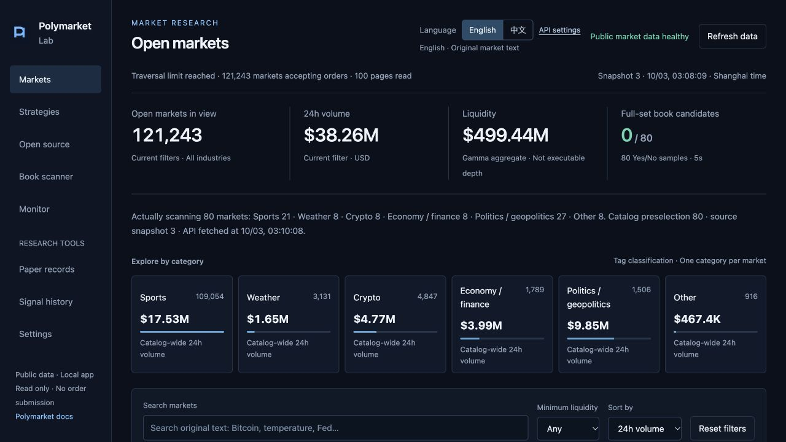
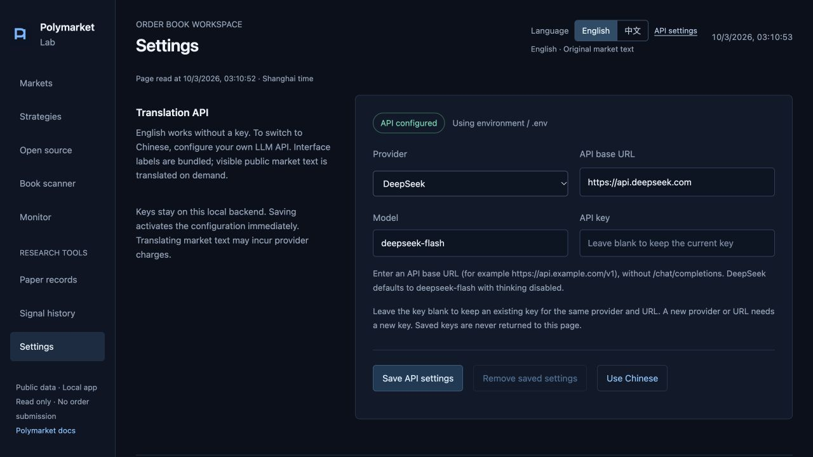

# Polymarket Lab 中文使用指南

**[English](README.md) · [简体中文](README_CN.md)**

这是本地运行、只读取公开数据的 Polymarket 研究台：浏览行业市场、核验真实结果盘口、估算二元完整集成本、观察有限样本候选。行情直接来自官方 Gamma、CLOB、Market WebSocket，不抓网页 HTML。

网站**默认英文**。需要中文时，先在 **Settings → Translation API（设置 → 翻译 API）** 配置自己的 LLM API，再点击 **中文**。Docker 通过后端 `.env` 配置。没有配置密钥时，网站保持英文并提供配置入口。本中文 README 已随项目编写，阅读文档本身不需要 API。

**计算有效、净差为正、通过当前候选门槛是三件事。** 项目不连接钱包、不签名、不下单、不转移资金，也没有持仓、真实成交或已实现收益。体育、天气、加密研究页与高星开源项目提供有日期的参考，未实现经过验证的预测模型，不保证赚钱。

下面按 A–E 阶段完成安装和验收。[功能评测报告](docs/FEATURE_EVALUATION.md) 分开记录实际运行、mock/合成边界和未实测平台。详细说明：[接口](docs/API_REFERENCE.md)、[计算口径](docs/CALCULATION.md)、[架构](docs/ARCHITECTURE.md)、[功能审计](docs/FUNCTIONAL_AUDIT.md)、[开源评审](docs/OPEN_SOURCE_REVIEW.md)。



## A. 安装与启动

准备 Git、**Python ≥3.11**（推荐 3.12），以及安装依赖和访问 Polymarket 公开接口的网络。运行网站不需要 Node、npm 构建或 Polymarket 账号/API 密钥。**完整前端回归测试需要 Node.js ≥18**。英文模式不需要 LLM API；选择中文后，新市场文本翻译会使用自己提供商的额度。

```sh
git clone https://github.com/EthanAlgoX/polymarket-lab.git
cd polymarket-lab
```

### macOS 一键启动

```sh
cp .env.example .env
./start-local.command
```

脚本在项目内建立 `.venv`，需要时安装锁定运行依赖。找不到合适 Python 时，可用 `PM_PYTHON` 指定解释器。没有继承翻译密钥时，脚本会读取用户交互式 zsh 环境，那里可能已有 DeepSeek 配置。保持终端运行，Ctrl+C 结束服务。

### macOS / Linux 手动启动

```sh
python3 --version
python3 -m venv .venv
source .venv/bin/activate
python -m pip install -r requirements-lock.txt
cp .env.example .env
python -m app
```

始终在项目目录执行，`.env`、数据库和日志相对路径都以此为准。`python -m app` 使用校验后的 `PMS_HOST` / `PMS_PORT`。8000 已被占用时，在 `.env` 改为 `PMS_PORT=8127`，随后访问 8127。

启动后打开 [http://127.0.0.1:8000](http://127.0.0.1:8000)，先查看市场目录和运行监控。中文设置见下方[语言切换与自己的翻译 API](#语言切换与自己的翻译-api)；原生本地运行时，通过网站保存 API 不需要修改源码或重启。

### Windows

确保 `python` 命令是 Python ≥3.11，在 PowerShell 中执行：

```powershell
.\install.bat
.\run.bat
```

安装脚本建立 `.venv`、安装锁定运行依赖、只在缺失时复制 `.env`、初始化数据库结构。开发检查另行安装依赖。也可手动运行，不必修改 PowerShell 执行策略：

```powershell
python -m venv .venv
.\.venv\Scripts\python.exe -m pip install -r requirements-lock.txt
Copy-Item .env.example .env
.\.venv\Scripts\python.exe -m app
```

### Docker

需要 Docker 和 **Docker Compose ≥2.24.0**，因为 Compose 文件使用可选 `env_file`（见 [Docker 官方文档](https://docs.docker.com/compose/how-tos/environment-variables/set-environment-variables/)）。

```sh
cp .env.example .env
docker compose up --build
```

Compose 可读取被 Git 忽略的本地 `.env`。容器内固定监听 0.0.0.0:8000，数据库固定为 `/app/data/scanner.db`；Compose 这三项会覆盖 `.env` 对应值。主机映射固定为 **127.0.0.1:8000**。命名卷保存容器数据库、翻译缓存和日志，与本地 `data/`、`logs/` 分开。`docker compose down` 停止服务但保留卷；需要保留记录时不要添加 `-v`。镜像使用锁定依赖和非 root 用户。

Docker 使用中文时，启动前在被忽略的 `.env` 中填写 `DEEPSEEK_API_KEY`。修改后执行 `docker compose up -d --force-recreate` 重新载入环境，再点击中文。网站可以读取 API 状态，但 **Docker 桥接网络不支持 Save API settings / Remove saved settings**，因为密钥变更要求请求来源为本机 loopback。容器使用 `.env` 配置翻译，不要把密钥写进镜像或 Compose 文件。

实际平台验证范围见 [本轮评测](docs/FEATURE_EVALUATION.md)；提供 Windows/Docker 步骤不等于已经在当前 macOS 主机运行过相应环境。

## 首次运行前的配置

以下例子不包含真实密钥：

```dotenv
PMS_HOST=127.0.0.1
PMS_PORT=8000
PMS_ENABLE_LIVE_SCANNER=true
PMS_MAX_MARKETS=40
PMS_MINIMUM_LIQUIDITY=1000
PMS_MINIMUM_VOLUME=0
PMS_DEFAULT_QUANTITY=10
DEEPSEEK_API_KEY=
```

| 配置 | 含义 / 默认值 |
| --- | --- |
| `PMS_MAX_MARKETS` | 扫描样本上限，40；允许 5–500。市场目录范围大于扫描集合。 |
| `PMS_MINIMUM_LIQUIDITY` / `PMS_MINIMUM_VOLUME` | 预选最低 Gamma 流动性 / 累计成交量，1000 / 0；成交量门槛不是 24h 成交量。 |
| `PMS_MARKET_REFRESH_SECONDS` / `PMS_REST_REFRESH_SECONDS` | 市场元数据 API 复核 / REST 盘口轮询的等待间隔，60 / 5 秒；实际周期还包括请求耗时，读取时间不等于源更新时刻。 |
| `PMS_MAX_QUOTE_AGE_SECONDS` | 来源盘口最大允许年龄，5 秒。重新请求不会使静默盘口的来源时间变新。 |
| `PMS_EXTRA_COST` | 扫描器固定其他成本假设，0.05 pUSD；目录抽屉的成本可单独调整。 |
| `PMS_DATABASE_URL` | SQLite 数据库，`sqlite:///data/scanner.db`；翻译另存 `data/translations.sqlite3`。 |
| `PMS_ENABLE_LIVE_SCANNER` | 为 `false` 时不启动 Polymarket 后台采集，也不会生成模拟行情或盈利记录。 |

启动配置优先级是进程环境变量高于 `.env`。**数据库保存的五个界面参数会在重启时覆盖对应环境默认值**：最低净差、最低净收益率、每腿股数、滑点率、安全缓冲率。其他启动配置修改后需要重启。已有数据库的这五项请通过参数页/API 修改；只改 `.env` 不会覆盖已保存组。

## 语言切换与自己的翻译 API

语言按钮同时切换界面文案和市场展示内容。英文显示官方原文，不发起 LLM 翻译请求。首次访问使用英文，后续记住主动选择的语言。中文要求后端已配置 API 密钥，即使浏览器里已有中文翻译缓存也不能绕过这个条件。

1. 打开 **Settings → Translation API**。
2. 选择 **DeepSeek**，默认地址 `https://api.deepseek.com`、模型 `deepseek-flash`；或选择 **OpenAI-compatible**，填写自己提供商的公开 HTTPS API 基础地址和模型名称。
3. 填写 **API key**，点击 **Save API settings（保存 API 设置）**，立即生效。配置状态会区分网站保存或后端环境来源；读取配置不会把密钥返回浏览器。
4. 点击 **Use Chinese（使用中文）** 或语言按钮 **中文**。固定界面文案使用项目内中文版本；新出现的可见标题、事件、结果和展开规则批量翻译、持久缓存。等待或失败时仍显示原文，并提示当前状态。

网站保存/移除按钮需要原生本地运行。Docker 请按[上面的环境配置方式](#docker)使用，并在修改 `.env` 后重建容器实例。远程局域网浏览器可以读取配置状态并使用已配置 API，但不能通过网站修改密钥。

兼容模式填写 **API 基础地址**，不要填写完整的聊天接口。例如，提供商接口为 `/v1/chat/completions` 时，基础地址通常以 `/v1` 结尾。仅接受公开 HTTPS 地址和默认 443 端口，不支持 localhost、私网地址或其他协议。集成要求 OpenAI 风格的 **Chat Completions** 协议和支持 JSON 输出的模型，不支持仅提供其他 API 协议的服务；不会自动选择或升级模型。保存只校验配置格式，不能证明密钥有效、余额充足、模型存在或接口兼容。

网站配置保存在被 Git 忽略的本地 `data/llm-config.json`，Unix 上使用仅所有者可读写的文件权限。它优先于环境中的 DeepSeek 配置，重启后保留。编辑同一提供商、同一 API 基础地址时，可留空密钥以保留已有密钥；改变目标地址需重新填写目标对应的密钥。**Remove saved settings（移除网站保存的设置）** 删除网站覆盖项并回退到后端环境配置，所以环境已有密钥时，移除之后中文仍可能可用。密钥变更需要原生本机 loopback 连接。备份时将这个文件作为私密配置处理。

也可在后端环境或被忽略的项目 `.env` 中设置 `DEEPSEEK_API_KEY` 后重启；接受别名 `DEEPSEEK_KEY` / `PMS_DEEPSEEK_API_KEY`。`DEEPSEEK_API_BASE` 仅接受官方 `https://api.deepseek.com` 或 `/v1`。原来已有的环境配置也满足中文使用条件。不要把密钥写进前端代码、截图、日志或 GitHub issue。

DeepSeek 预设使用 `deepseek-flash`（DeepSeek V4.1 Flash），是 2026-10-02 核实的官方最便宜模型，禁用思考。首次翻译新文本消耗提供商额度；英文模式、固定界面中文和已缓存翻译不消耗翻译额度。完整性校验失败最多用同一配置模型纠正重试一次。数字、符号和 URL 校验不能证明完整语义准确，结算仍须核对原文；翻译不改变价格、ID、token/outcome 顺序或计算输入。目录搜索使用原始标题/事件；扫描搜索也匹配已显示中文，CSV 始终导出原文。



## B. 确认就绪，逐页使用

打开 [http://127.0.0.1:8000](http://127.0.0.1:8000)。在线启动会先读取初始公开样本和盘口，可能需要等待；较大的目录随后在后台遍历。

- [ ] [健康接口](http://127.0.0.1:8000/health) 返回 `status: "ok"`、`mode: "public-read-only"`。它检查本地数据库，**不证明上游行情已新鲜**。
- [ ] [运行监控](http://127.0.0.1:8000/monitor) 查看 Gamma/CLOB、REST 时间、实际扫描数量、WS、最近错误及请求统计。WS 连通不代表计算书新鲜。
- [ ] 目录显示版本、更新时间、覆盖状态和行业选样。`capped` 表示触及遍历上限；`partial`/错误说明本轮中断并可能保留旧数据。

九个侧栏入口的操作与预期：

| 入口 | 操作 | 预期结果 |
| --- | --- | --- |
| Markets / 市场目录 | 选行业、搜索英文原始标题/事件、调整流动性/排序、翻页、重置 | 统计和列表对应同一目录版本。“刷新数据”读取本地快照，不强制重新遍历全站。 |
| Strategies / 交易空间 | 阅读行业信号、所需数据、失效场景与来源 | 研究方向；尚无天气观测、体育赔率或经过校准的实时预测判断。 |
| Open source / 开源参考 | 切换高星、高星未归档、全部；打开仓库/源码链接 | star、维护、许可和采用决定是有日期的静态资料，不以高星证明收益或兼容性。 |
| Book scanner / 盘口扫描 | 搜索候选、看详情、保存模拟 | 只列出当前选定 Yes/No 市场中通过全部门槛的结果；自动刷新保留搜索。 |
| Monitor / 运行监控 | 比较链路/数据库状态、时间、样本和重试 | 本地健康、上游连通和报价新鲜度分开判断；模拟估算合计不是实收收益。 |
| Paper records / 模拟记录 | 刷新、前后翻页、导出 | 每页 100 条，当时估算不会随新价格重算；空库也能正常展示。 |
| Signal history / 信号历史 | 看首次/最近发现、最大估算、active/disappeared | 过去观察结果，历史状态不是当前可执行许可；每页 100 条。 |
| 设置 / Settings | 配置翻译 API，编辑并保存五项扫描参数 | API 保存立即生效；扫描参数整组原子保存，旧候选清空等待下一次成功计算，未保存/失败有明确提示。 |
| Logs / 运行日志 | 选 INFO/WARNING/ERROR、刷新 | 最近 100 条本地事件，可见时约每 5 秒读取。 |

目录中点“核验盘口”打开抽屉：核对原始 outcome/token 对应，修改每腿数量和其他成本，查看每个结果的买卖盘、盘口质量及展开规则，Escape 关闭。已关闭、停止接单、映射改变会给出暂停原因；费用/最低数量未知、过期或无效书也不能判为有效候选。三个及以上结果全部展示，但没有多结果完整集策略。扫描器的独立详情另列 REST 计算书和计算时间，与可能更晚的 WS 展示书区分。

页面隐藏时暂停前端轮询，后台仍运行。详情/扫描/监控/日志通常每 5 秒重新读取，目录页面每 15 秒；完整目录每轮结束后等待 600 秒，最多 100 页、每页 100 个事件，一个事件可以包含多个市场。Gamma 响应可能来自缓存，“核验于”/`metadataAsOf` 只表示成功读取的时间，不保证源头刚刚更新。

### 候选为 0，如何区分正常与失败

**0 个候选可以完全正常，也不能推出全站没有机会。** 有限样本可能在手续费、成本、数量和利润/收益率门槛后没有正差；`VALID` 数学计算也可能是负净差。费用未知、最低数量未知和过期书都会主动阻断。

查看监控的 Gamma/CLOB 状态、最近错误、真实来源年龄、核实样本数量、目录覆盖时间，以及详情的具体暂停原因。健康接口 200 但上游异常，说明本地服务可用而采集降级；刚拿到的 REST 响应仍可能带旧盘口时间，继续标为 `STALE`。红色刷新提示表示当前保留旧快照。样本量和 WS 连通都不是获利信号。

## C. 保存观察，调整参数，读取历史

“保存模拟”只保存当时估算。后端在刷新锁内重新核验：市场/书标识匹配、费用支持且已知、最低数量已知、完整深度、来源时间新鲜、当前市场状态、共同股数和净差/收益率门槛。没有结果、过期或未达门槛时返回 **409**，不新增成功记录。快速连续点击会防重复提交；之后主动再保存一次有效观察仍允许独立记录。

真实市场没有候选时，验收空态及 E 阶段的模拟回归即可，不必制造所谓真实盈利交易。

- [ ] 有真实当前候选时保存一次，`/paper-trades` 出现记录 ID，监控计数增加。
- [ ] 改参数后看到“未保存”，保存后等待新计算；重启恢复保存组。只是试验流程时，记录并恢复原值。
- [ ] 历史/模拟超过 100 条可翻下一页，空库和最后一页禁用下一页。记录来自本地数据库，来自钱包的成交记录并未接入。

参数 API 为 `GET /api/settings` / `PUT /api/settings`，PUT 必须提供完整五字段。收益率/缓冲率用小数，例如 `0.002` 代表 0.2%，不是 0.002%。下面是首次默认值，已有有效保存组会覆盖它们：

| API 字段 | 默认值 | 允许范围 |
| --- | --- | --- |
| `minimum_net_profit` | `0.10` pUSD | 0–1000 |
| `minimum_net_roi` | `0.002` | 0–1 |
| `default_quantity` | 每腿 `10` 股 | >0–100000 |
| `slippage_rate` | `0.001` | 0–0.25 |
| `safety_rate` | `0.001` | 0–0.25 |

列表 API 返回记录 ID；将 `RECORD_ID` 替换为真实返回的 ID：

```text
GET /api/paper-trades?limit=100&offset=0
GET /api/paper-trades/RECORD_ID
GET /api/opportunities/history?limit=100&offset=0
GET /api/opportunities/history/RECORD_ID
```

详情的 `details.audit` 包含原始映射、参数、来源/时间及当时两个 REST 输入；旧版本记录可能没有这些字段。可在 [Swagger /docs](http://127.0.0.1:8000/docs) 查看结构和发请求，未知 ID 返回 404，参数越界 422。抽屉修改数量/成本只用于该次核验，不会自动保存全局参数。

## D. 导出、备份与升级

页面下载按钮或下列接口会导出保存记录：

```text
GET /api/exports/opportunities.csv
GET /api/exports/paper-trades.csv
```

CSV 流式导出**全部保存行**，空库也有固定表头，UTF-8 BOM，标题保留原文，公式样式文本经过转义。记录时间含 UTC 偏移，界面转为上海时间；导出的估算不是已实现收益。

停止服务后，离线脚本读取配置数据库，不访问上游：

```sh
python -m scripts.export_sample --output exports/paper-trades.csv
```

可选 `python -m scripts.init_db` 只准备数据库结构，不改变已有信号状态，正常启动已自动完成。`python -m scripts.reset_database` 是销毁 SQLite 的维护操作，会检查实际配置文件/服务并要求键入 `RESET`，安装和日常排错不需要使用。

停止服务再备份 `.env` 和整个 `data/`，包含本地记录、参数、翻译缓存以及网站保存的 LLM 密钥；请私密保存备份。日志在 `logs/`，运行文件被 Git 忽略。项目没有完整保存全市场历史盘口、回放/回测、自动保留期限/删除任务，跨事件/跨平台套利也未实现。

已有项目先停服务、备份，再更新：

```sh
git pull --ff-only
python -m pip install -r requirements-lock.txt
python -m app
```

使用已激活的项目 venv；Windows 可换成 `.venv\Scripts\python.exe`。保留已有 `.env`，比较新的 `.env.example` 增量，不要覆盖。Git 报本地冲突时先检查，不要重置丢弃自己改动。当前初始化保留已有记录，未来迁移以对应发布说明为准。Docker 用 `docker compose up --build` 重建，保留命名卷。

## E. 开发检查与明确的在线验证

安装 **Node.js ≥18**，检查 `node --version`；Node VM 前端回归不需要安装 npm 包。

```sh
python -m pip install -r requirements-dev.txt
python -m ruff check .
python -m ruff format --check .
python -m mypy app
python -m pytest
python scripts/security_scan.py
```

默认 pytest 排除在线测试，付费翻译用 mock。缺少 Node 时前端 VM 用例会明确跳过，因此仅 Python 测试通过不等于完整回归通过。Windows 将 `python` 换成 `.venv\Scripts\python.exe`；安装开发依赖后可用 `lint.bat` / `test.bat`。

明确访问真实 Gamma/CLOB/地区/Market WS，且不调用钱包或付费翻译：

```sh
python -m pytest -m live -o addopts="" -s tests/live
```

同等入口为 `python -m scripts.smoke_test`，Windows 为 `live_test.bat`。网络结果受当时接口状态影响，成功也不保证收益；[评测报告](docs/FEATURE_EVALUATION.md) 将实际公开数据与合成记录/候选分开记载。

### 维护者：隔离合成数据的界面验收

不必等待真实市场出现盈利候选，可复现保存记录和阻断条件：

```sh
python tests/manual/fixture_server.py --port 8128
```

访问 [http://127.0.0.1:8128](http://127.0.0.1:8128)。市场与记录均标为 **`[TEST]`**。该 harness 只绑定本机，数据库/缓存临时隔离，翻译密钥为空，provider 为本地 stub，不请求外部行情，拒绝使用 8000；Ctrl+C 清理临时数据。合成价格不是真实机会。

- **101** 是唯一当前合成扫描候选。保存一次，找到新记录并检查 `details.audit`，其中注明合成来源。
- **102** 费用未知、**103** 最低数量未知、**104** 交叉盘口、**105** 来源时间无效/STALE、**106** API 复核返回已关闭，都不能列为可执行候选。
- **107** 展示全部三个结果但没有二元计算；**108** 允许 Up/Down 成本核验，仍不进入 Yes/No 扫描器。
- 40 条额外目录项及预置的 101 条模拟/历史记录用于跨页及 CSV 验收。运行中的测试扫描可能新增历史观察，应比较实际列表/导出行数，不假定固定总数。
- 按 B–D 操作，比较桌面/窄屏，将证据写入评测；与自然公开数据分开记录。

如需无密钥、无上游首次运行验收，使用另一个项目检出/数据目录，设置 `PMS_ENABLE_LIVE_SCANNER=false`、`PMS_PORT=8127`，确保所有翻译密钥别名都未设置或为空，也不复制已有 `data/llm-config.json`，运行 `python -m app`。应有健康接口和九个入口、空市场/候选，保存模拟被拒绝。英文应立即可用；点击中文应保持英文并提供 **Configure API** 入口。这证明本地安装和缺少密钥的处理流程，不证明 Polymarket 连通。

## 常见故障

| 现象 | 检查与处理 |
| --- | --- |
| 找不到 Python 或版本太旧 | 查 `python3 --version` / Windows `python --version`，安装 ≥3.11；macOS 可指定 `PM_PYTHON`。 |
| 端口被占用 | 停止需要替换的旧服务或改 `PMS_PORT`；Compose 的主机端口映射仍按文件固定为 8000。 |
| 启动慢、目录部分覆盖 | 查看终端/日志/监控，启动要先预热公开请求，目录有上限且网络会有限重试。 |
| 健康接口 503 | 查数据库路径/权限及磁盘，是本地存储故障；不要把删库当常规修复。 |
| 健康 200 但扫描为空 | 查上游、核实样本、门槛、来源时间和原因；离线模式或无候选可能是预期行为。 |
| 点击中文提示 Configure API | 在设置页保存自己的 API；或配置后端环境密钥并重启。只有旧中文缓存不能启用中文。 |
| Docker 或局域网提示不能保存 API | 网站密钥变更要求原生本机连接。Docker 从 `.env` 读取，修改后用 `docker compose up -d --force-recreate` 重建容器实例。 |
| 已保存 API，市场仍有英文 | 查看翻译状态，核对密钥、模型、基础地址、JSON 支持和余额；在网站保存修改无需重启，再主动重试。 |
| 改 `.env` 后值没变 | 启动配置要重启；已保存五参数优先，需要在界面/API改保存组。 |
| 前端用例跳过 | 安装 Node 后重跑，查看 skipped 汇总。 |
| 旧记录缺 audit | 旧版没有保存的输入无法事后恢复；历史状态会在重启/新扫描时重新核验。 |

## 许可与来源

MIT。采集/扫描底座来自 [0106ss/polymarket-market-scanner](https://github.com/0106ss/polymarket-market-scanner)，上游提交 `587daca8548f6c737b4d642b49c9f000247361ab`。原版权与许可在 [LICENSE](LICENSE)，本地改动见 [UPSTREAM.txt](UPSTREAM.txt)。其他仓库为研究参考，没有集成其交易 SDK。贡献、安全和改动记录：[CONTRIBUTING.md](CONTRIBUTING.md)、[SECURITY.md](SECURITY.md)、[CHANGELOG.md](CHANGELOG.md)。
